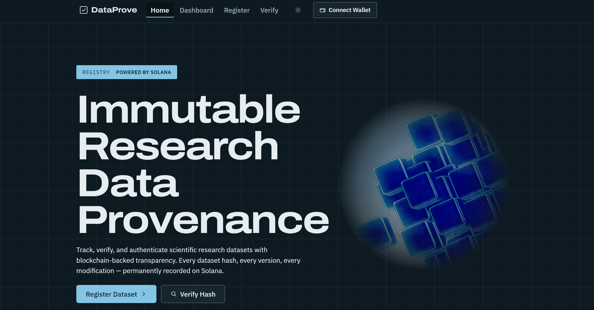
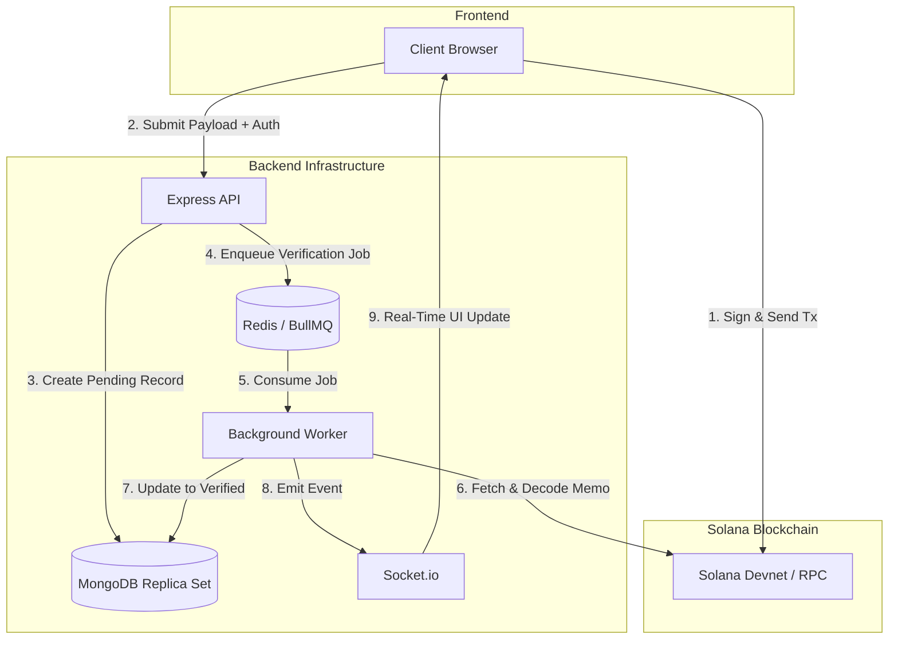

# DataProve

> **Decentralized Research Data Provenance & Integrity Tracker**

[](https://www.typescriptlang.org/)
[](https://solana.com/)
[](https://www.docker.com/)
[](https://www.mongodb.com/)
[](https://redis.io/)



---

## Project Overview

DataProve is a decentralized provenance tracking system built to guarantee the integrity and version history of scientific research datasets.

In modern research, proving that a dataset existed at a specific time — and has not been tampered with since — is a major challenge. DataProve solves this by anchoring cryptographic SHA-256 hashes of datasets onto the Solana blockchain. This guarantees an immutable timeline and proof-of-existence, entirely without exposing the raw, sensitive underlying research data to the public.

---

## Key Features

* **Client-side hashing.** SHA-256 checksums are computed inside the browser. Research files never leave the researcher's machine — only the digest and its metadata are ever transmitted.
* **Ed25519 payload authentication.** Every write (registration, update, transfer) requires the client to cryptographically sign the API payload. Signatures are verified server-side with TweetNaCl, so a request cannot be forged or replayed by anything that doesn't hold the key.
* **Asynchronous RPC verification.** Writes return immediately and enqueue a BullMQ job; a background worker fetches and decodes the Solana transaction out-of-band, so chain latency never blocks the API thread.
* **Atomic database transactions.** Register and update run inside MongoDB multi-document transactions via Mongoose sessions, with atomic `$inc` on the version counter — no partial writes, no lost updates under concurrent revisions.
* **Public verification.** Anyone can paste a digest or hash a file locally and check it against the registry. No account, no wallet, no dependency on this service staying online.
* **Real-time status.** Socket.io pushes the verification result to the page the moment the worker settles it.

---

## How It Works (User Flow)

1. **Hash generation.** A researcher selects a dataset file in the browser. The React frontend computes the SHA-256 hash locally.
2. **Blockchain anchoring.** The user's Solana wallet (e.g. Phantom) prompts them to sign and broadcast a transaction containing this hash to Solana devnet.
3. **Payload submission.** Once the transaction confirms, the frontend sends the signature and dataset metadata to the Express API, authenticating the request with an Ed25519 signature.
4. **Asynchronous verification.** The backend returns immediately while a background worker independently queries Solana to verify the transaction. Only then is the record marked `verified`.

If the chain confirms but the API is unreachable, the anchor still exists — the record is queued in `localStorage`, retried on the next load, and reported as pending rather than failed.

---

## Architecture & Trust Model

### Eliminating frontend trust vulnerabilities

Traditional Web3 designs suffer from frontend trust vulnerabilities where the backend API blindly accepts client-reported transaction hashes. DataProve eliminates this vector by separating the write request from on-chain confirmation.

The backend accepts payload writes under a `pending` status, enqueues the transaction signature into a BullMQ queue, and offloads verification to a background worker. The worker queries a trusted Solana RPC endpoint directly, decodes the transaction data, and asserts that the signed on-chain hash matches the database value before transitioning the status to `verified`.

The client is also blocked from creating an unanchored record in the first place: the API rejects any register or update request that arrives without a transaction signature, so the database cannot become the source of truth by accident.

### Architectural flow



---

## Tech Stack

* **Frontend:** React 18, Vite, Framer Motion, Socket.io client
* **Backend:** Node.js, Express, TypeScript (strict mode), TweetNaCl, Mongoose
* **Database:** MongoDB 7 (single-node replica set, for ACID transaction support)
* **Infrastructure:** Docker, Docker Compose, Redis 7 (BullMQ broker)
* **On-chain:** Anchor (Rust), Solana devnet

The frontend uses no UI framework. Colour, type and spacing are two-tier CSS custom properties in `frontend/src/styles/`, and `scripts/verify/contrast.mjs` computes every foreground/background pairing against WCAG AA so a token change can't quietly break contrast.

---

## Project Structure

```text
data-prove/
├── backend/                # Express API & background workers
│   ├── src/
│   │   ├── middleware/     # Ed25519 auth & validation
│   │   ├── models/         # Mongoose schemas
│   │   ├── queues/         # BullMQ configuration
│   │   ├── routes/         # API endpoints
│   │   ├── services/       # DB + Solana service layer
│   │   └── workers/        # Async Solana RPC verifier
│   ├── Dockerfile
│   └── package.json
├── frontend/               # React / Vite application
│   ├── src/
│   ├── Dockerfile
│   └── package.json
├── programs/               # Anchor (on-chain) program
├── infra/
│   └── mongo-init.js       # Replica set initialization
├── scripts/
│   ├── bootstrap.js        # Environment setup automation
│   ├── seed.mjs            # Demo dataset seeding
│   └── verify/             # Contrast, PDA and IDL checks
├── docker-compose.dev.yml  # Multi-container orchestration
└── package.json
```

---

## Getting Started

### Prerequisites

* Node.js 20.19 or higher (`mongoose@9` requires it)
* Docker Desktop, running
* A Solana browser wallet such as Phantom, set to **Devnet**

### Quick start

```bash
git clone https://github.com/swapnil5053/data-prove.git
cd data-prove
npm install
npm run dev
```

`npm run dev` runs a bootstrap script to generate any missing `.env` files, then starts Docker Compose: MongoDB as a replica set, Redis, the Express API, the verification worker and the React frontend.

* **Frontend:** [http://localhost:5173](http://localhost:5173)
* **API health:** [http://localhost:3001/api/health](http://localhost:3001/api/health)

### Running the servers outside Docker

Faster to iterate on. Databases stay containerized:

```bash
docker compose -f docker-compose.dev.yml up -d mongodb redis mongo-init

cd backend  && npm install && npm run dev    # :3001
cd frontend && npm install && npm run dev    # :5173

node scripts/seed.mjs                        # five demo datasets
```

> **MongoDB from the host:** the container publishes **27018**, and the replica set advertises itself under its Docker hostname. Connect with `?directConnection=true` — with `?replicaSet=rs0` the driver discovers `mongodb:27017` and tries to reach a name that doesn't resolve outside the Docker network, producing a server-selection timeout that looks exactly like a wrong port.

---

## Environment Variables

Generated from `.env.example` during bootstrap.

| Variable | Service | Default | Purpose |
| :--- | :--- | :--- | :--- |
| `PORT` | Backend | `3001` | Express API network port |
| `MONGO_URI` | Backend | `mongodb://localhost:27018/dataprove?directConnection=true` | MongoDB connection URL |
| `REDIS_HOST` / `REDIS_PORT` | Backend | `127.0.0.1` / `6379` | Redis (BullMQ broker) |
| `SOLANA_RPC_URL` | Backend | `https://api.devnet.solana.com` | Solana RPC node endpoint |
| `ALLOWED_ORIGINS` | Backend | `http://localhost:5173` | CORS whitelist for client origins |
| `VITE_API_BASE_URL` | Frontend | `http://localhost:3001` | API base URL for network/WebSocket calls |
| `VITE_SOLANA_CLUSTER` | Frontend | `devnet` | Cluster the client connects to |

---

## Status

Register, update, transfer, deactivate, hash verification and version history all work end-to-end against Solana devnet. Deployed to devnet only; the on-chain program has not been audited.
