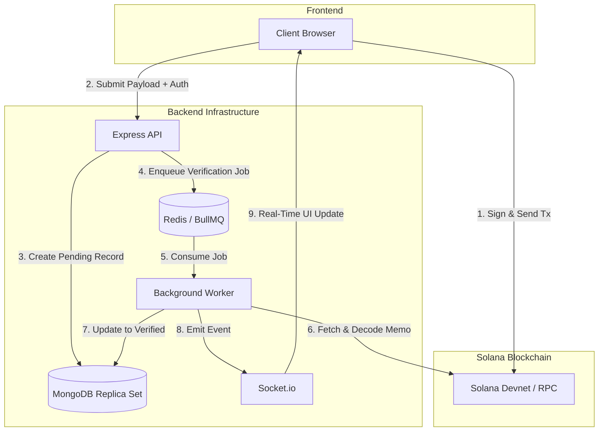

# DataProve

> **Decentralized Research Data Provenance & Integrity Tracker**

[](https://www.typescriptlang.org/)
[](https://solana.com/)
[](https://www.docker.com/)
[](https://www.mongodb.com/)
[](https://redis.io/)

---

## Project Overview

DataProve is a decentralized provenance tracking system built to guarantee the integrity and version history of scientific research datasets. 

In modern research, proving that a dataset existed at a specific time—and has not been tampered with since—is a major challenge. DataProve solves this by anchoring cryptographic SHA-256 hashes of datasets onto the Solana blockchain. This guarantees an immutable timeline and proof-of-existence, entirely without exposing the raw, sensitive underlying research data to the public.

---

## Key Features

* **Local-First Zero-Trust Hashing:** Computes SHA-256 checksums inside the client browser. Sensitive research files never leave the researcher's local machine, ensuring complete data privacy.
* **Ed25519 Payload Authentication:** Secures database write operations (registration, updates, transfers) by requiring clients to cryptographically sign API payloads. Signatures are verified server-side using TweetNaCl to guarantee non-repudiation.
* **Asynchronous RPC Verification:** Processes high-throughput writes instantly by enqueuing verification jobs to a BullMQ queue, allowing a background worker to fetch and decode Solana transaction logs asynchronously without blocking the main API thread.
* **Atomic Database Transactions:** Employs MongoDB multi-document ACID transactions via Mongoose sessions and atomic `$inc` operators to completely eliminate race conditions and prevent partial writes during high-concurrency updates.

---

## How It Works (User Flow)

1. **Hash Generation:** A researcher selects a dataset file in the browser. The React frontend computes the SHA-256 hash locally.
2. **Blockchain Anchoring:** The user's Solana wallet (e.g., Phantom) prompts them to sign and broadcast a transaction containing this hash to the Solana Devnet.
3. **Payload Submission:** The frontend sends the transaction signature and dataset metadata to the Express API, authenticating the request with an Ed25519 signature.
4. **Asynchronous Verification:** The backend immediately returns a success response to the user while a background worker independently queries the Solana blockchain to verify the transaction. Once verified, the database is permanently updated.

---

## Architecture & Trust Model

### Eliminating Frontend Trust Vulnerabilities
Traditional Web3 designs suffer from frontend trust vulnerabilities where the backend API blindly accepts client-reported transaction hashes. DataProve eliminates this vector by separating the write request from on-chain confirmation. 

The backend accepts payload writes under a `pending` status, enqueues the transaction signature into a BullMQ queue, and offloads verification to a background worker. The worker queries a trusted Solana RPC endpoint directly, decodes the transaction data, and asserts that the signed on-chain hash matches the database value before transitioning the status to `verified`.

### Architectural Flow



---

## Tech Stack

* **Frontend:** React 18, Vite, Framer Motion, Socket.io Client
* **Backend:** Node.js, Express, TypeScript (Strict Mode), TweetNaCl, Mongoose
* **Database:** MongoDB 7 (Single-node replica set for ACID transaction support)
* **Infrastructure:** Docker, Docker Compose, Redis 7 (BullMQ broker)

---

## Project Structure

```text
dataprove/
├── backend/                # Express API & Background Workers
│   ├── src/
│   │   ├── middleware/     # Ed25519 Auth & validation
│   │   ├── models/         # Mongoose schemas
│   │   ├── queues/         # BullMQ configuration
│   │   ├── routes/         # API endpoints
│   │   └── workers/        # Async Solana RPC verifier
│   ├── Dockerfile
│   └── package.json
├── frontend/               # React / Vite Application
│   ├── src/
│   ├── Dockerfile
│   └── package.json
├── infra/                  # Infrastructure configurations
│   └── mongo-init.js       # Replica set initialization
├── scripts/
│   └── bootstrap.js        # Environment setup automation
├── docker-compose.dev.yml  # Multi-container orchestration
└── package.json            # Root configuration
```

---

## Getting Started

The entire development stack is containerized for a seamless setup experience. 

### Prerequisites
Make sure you have the following installed on your local machine:
* Node.js (v18 or higher)
* Docker Desktop (must be running)
* A Solana browser wallet (like Phantom) set to **Devnet**.

### Quick Start (One-Command Boot)

1. Clone the repository and navigate into the root directory:
   ```bash
   git clone https://github.com/swapnil5053/data-prove.git
   cd data-prove
   ```

2. Install the root dependencies and start the Docker stack:
   ```bash
   npm install
   npm run dev
   ```

The `npm run dev` command executes a bootstrap script to generate missing configuration (`.env`) files, then starts the Docker Compose services to build and run MongoDB (as a replica set), Redis, the Express API, the background worker, and the React frontend.

3. **Access the Application:**
   * **Frontend UI:** [http://localhost:5173](http://localhost:5173)
   * **API Health Check:** [http://localhost:3001/api/health](http://localhost:3001/api/health)

---

## Environment Variables

The following variables are utilized across the stack. These are automatically generated from `.env.example` during the bootstrap phase.

| Variable | Service | Default | Purpose |
| :--- | :--- | :--- | :--- |
| `PORT` | Backend | `3001` | Express API network port. |
| `MONGO_URI` | Backend | `mongodb://localhost:27018/dataprove` | MongoDB connection URL. |
| `REDIS_HOST` | Backend | `127.0.0.1` | Redis instance hostname. |
| `SOLANA_RPC_URL` | Backend | `https://api.devnet.solana.com` | Solana RPC node endpoint. |
| `ALLOWED_ORIGINS` | Backend | `http://localhost:5173` | CORS whitelist for client origins. |
| `VITE_API_BASE_URL`| Frontend| `http://localhost:3001` | API base URL for network/WebSocket calls.|

---
## Contributors
- [Pritham](https://github.com/preeeetham)
- [Swapnil Kumar](https://github.com/swapnilsk)

